###半透明边框

前提
	rgba()
	hsla()

##默认情况下，背景包括了边框，即背景在边框之下，设置边框颜色是用边框颜色遮住了背景颜色，如果是半透明的边框，就遮不住背影颜色了。
所以需要用到背景剪裁background-clip，默认危border-box，即边框也在背景之内。
根据盒模型，可以手动的设置背景剪裁的范围

	padding-box
	border-box
	content-box

###多边框

方法1.

前提：
box-shadow
现在我们经常会使用到box-shadow来创建阴影，但很少知道她的第四个参数扩散半径，可以为他设置一个具体的值来增加或减小阴影。

可以使用多个阴影来模仿多个边框
	exp:
	background: yellowgreen;
	box-shadow: 0 0 0 10px #655, 0 0 0 15px deeppink;
	前的颜色在上层，后面的颜色在下层

但他也存在着一些缺点，box-shadow不像border,不会影响元素的布局，它不是盒模型的一部分，但你也可以使用padding,border，box-shadow的inset属性来模仿
因为不是盒模型的一部分，所以在边框上，无法捕捉鼠标的click,hover事件

方法2.
	前提:outline

	exp:
		background: yellowgreen;
		border: 10px solid #655;
		outline: 15px solid deeppink;

	可以通过设置outline-offset的正负值来控制outline与元素之间的距离

conclusion:
1.当设置两个边框时，可以根据实际情况选择方法，但设置两个以上的边框时，只能使用box-shadow
2.border-radius 对outline没有影响，outline一直为直角 

###灵活的背景定位
	第一中方式
	关位置关键词之后添加偏移位置
	background: url(code-pirate.svg) no-repeat #58a;
	background-position: right 20px bottom 10px;
	

	默认值background-position:padding-box;
	可以使用background-origin 来改变background-position默认的值
	background-position是相对background-image 这个属性来说的 而不是background-color

	第二种方式
	使用calc()
	background: url("code-pirate.svg") no-repeat;
	background-position: calc(100% - 20px) calc(100% - 10px);

###内圆角
前提：
	box-shadow
	outline

方式1：使用两个div元素实现，外面的div设置背景色，里面的div设置背景色和border-radius

	

		

		I have a nice subtle inner rounding,
		don’t I look pretty?
		

	

优点：可操作性强，可以为外边框设置各种背景图片纹理

方式2：使用一个div,利用outline来实现外部的直角边框，border-radius实现圆角，box-shadow的扩散半径来填充内部的间隙

	background: tan;
	border-radius: .8em;
	padding: 1em;
	box-shadow: 0 0 0 .6em #655;
	outline: .6em solid #655;

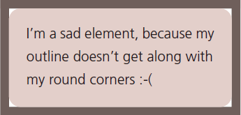

	background: tan;
	border-radius: 0.8em;
	padding: 1em;
	box-shadow: 0 0 0 0.6em #655;
	不使用outline,用box-shadow当边框时的样子，因为box-radius会影响box-shadow

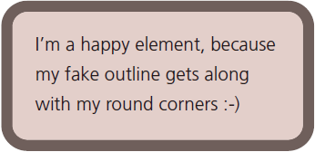

那么如何计算box-shadow的扩散半径

根据border-radius的大小，利用勾股定理来计算
border-radius=r
扩散半径=r*Math.sqrt(2) - r;
		=r(Math.sqrt(2)-1);
所以只需要设置一个大于等于扩散半径的值即可

###有纹理的背景
前提：
	linear-gradient
	background-size

一般实现有纹理的背景，方式主要为1px的位图的repeat或者使用svg背景
###水平渐变
设置背景的渐变色

	background: linear-gradient(#fb3, #58a);

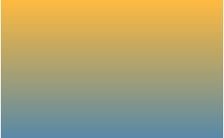

设置渐变色的起始点

	background: linear-gradient(#fb3 20%, #58a 80%);

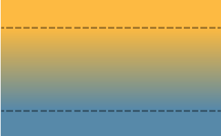

如果渐变的起始点在同一处，则渐变效果消失，效果为两条平行的颜色带

	background: linear-gradient(#fb3 50%, #58a 50%);

设置渐变其实是设置背景图像background-image,所以可以设置background-size的值来设置渐变的图像的大小

	background: linear-gradient(#fb3 50%, #58a 50%);
	background-size: 100% 30px;

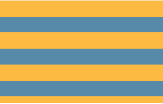

如果后一个渐变色的起点小于之前的起点，后一个渐变色的起点将默认设置为之前起点值的最大值

	background: linear-gradient(#fb3 30%, #58a 0);
	background-size: 100% 30px;

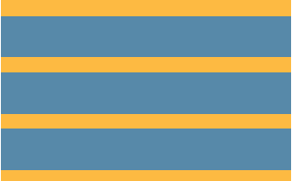

当然可以设置多个渐变色
	
	background: linear-gradient(#fb3 33.3%,#58a 0,
								#58a 66.6%, yellowgreen 0);
	background-size: 100% 45px;

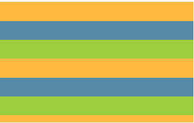

###垂直条纹
之前设置的条纹背景都是水平方向上的，当然也可以设置为垂直方向上的，主要是设置渐变的方向，默认渐变的方向为to bottom

	background: linear-gradient(to right, /* or 90deg */
	                            #fb3 50%, #58a 0);
	background-size: 30px 100%;

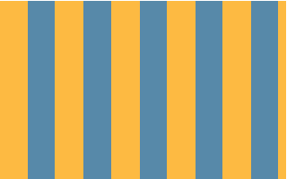

###斜条纹
同样是设置渐变的方向

	background: linear-gradient(45deg,
	#fb3 50%, #58a 0);
	background-size: 30px 30px;
	当效果并非理想的效果

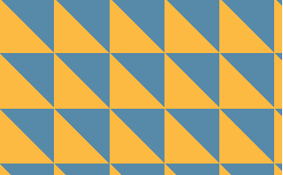

原因是我们给每一个平铺的渐变块旋转了45°，但平铺的渐变块不能形成一个整体的渐变，实际上需要的平铺的渐变块应该是如下的样子，需要四条颜色带而不是两条，所以我们需要设置更多的渐变起始点 color-stop

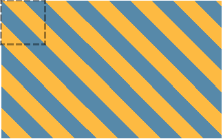

	background: linear-gradient(45deg,
				#fb3 25%, #58a 0, #58a 50%,
				#fb3 0, #fb3 75%, #58a 0);
	background-size: 30px 30px;

这样设置，条纹宽度会比水平或垂直方向的窄，原因如下

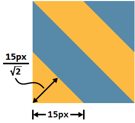

根据勾股定理可以看出端倪，若要宽度与水平或垂直方向上的相同，r=Math.sqrt(15*15+15*15) 约21.2，21.2*2=42.4所要设置background-size:42.4px 42.4px;

	background: linear-gradient(45deg,
								#fb3 25%, #58a 0, #58a 50%,
								#fb3 0, #fb3 75%, #58a 0);
	background-size: 42.4px 42.4px;

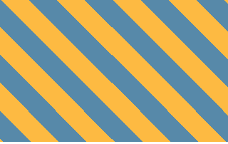

###更好的斜条纹
之前的那些方法，灵活性都不是很好，当渐变的角度设置为60,°，30°等一些其他角度时，结果看起来就会比较糟糕
如下的渐变角度设置为60°;

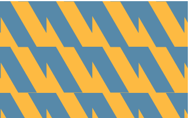

linear-gradient和radial-gradient 都有重复的一个版本
repeat-linear-gradient
repeat-radial-gradient,工作方式与之前的几乎一致，唯一不同的是渐变色的起始点会一直不断的重复下去，直到填充满整个背景图片

	background: repeating-linear-gradient(45deg,
	#fb3, #58a 30px);

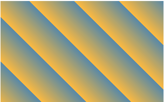

上面的代码等价于

	background: linear-gradient(45deg,
								#fb3, #58a 30px,
								#fb3 30px, #58a 60px,
								#fb3 60px, #58a 90px,
								#fb3 90px, #58a 120px,
								#fb3 120px, #58a 150px, ...);

repeat-linear-gradient 善于创建条纹背景，因为自带重复属性，无需担心手动去创建渐变平铺块
	
	background: repeating-linear-gradient(60deg,
	#fb3, #fb3 15px, #58a 0, #58a 30px);

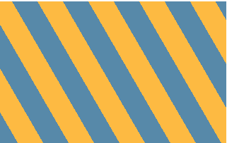

明显的好处
	1: 减少了重复的代码，
	2：在渐变中设置的起始点指定了条纹的宽度代替了background-size，而且指定的值即为条纹的宽度，省去了按倾斜角在根据勾股定理计算宽度的麻烦
	3：最主要的好处是可随意设置条纹的倾斜角度

	background: repeating-linear-gradient(60deg,
	#fb3, #fb3 15px, #58a 0, #58a 30px);

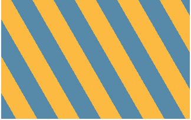

建议：设置水平或垂直条纹时，使用linear-gradient，设置倾斜条纹时用repeat-linear-gradient 45°时，两种方法随意选择

###灵活微妙的条纹	
时常，我们设置的条纹并非多个颜色，有些只是同一个颜色而具有不同的亮度

	background: repeating-linear-gradient(30deg,
	#79b, #79b 15px, #58a 0, #58a 30px);

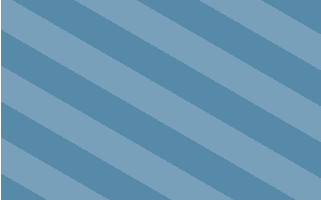

另一种思路，将暗颜色设置为背景，然后只需要设置浅的条纹即可

	background: #58a;
	background-image: repeating-linear-gradient(30deg,
	hsla(0,0%,100%,.1),
	hsla(0,0%,100%,.1) 15px,
	transparent 0, transparent 30px);
结果如上，这样的一个好处是当浏览器不支持渐变时，至少还有一个背景色

###复杂的背景样式
前提：css gradient  
      条纹背景
前面提到的都是一些条纹图案，但我们需要更多不同类型的几何图案，波点图案，棋盘图案等等。很多背景几乎都可以用css 来实现，只不过有些不太实际。太复杂的可以考虑使用css预编译器

	
####栅格背景
原理：两个半透明渐变的叠加

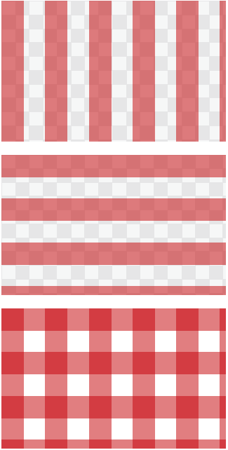

	background: white;
	background-image: linear-gradient(90deg,
					  rgba(200,0,0,.5) 50%, transparent 0),
					  linear-gradient(
					  rgba(200,0,0,.5) 50%, transparent 0);
	background-size: 30px 30px;

有些情况下我们想调整栅格的大小而不想改变栅格之间沟槽的大小，我们用具体的像素值而非百分比来指定渐变的起始点

	background: #58a;
	background-image:
	linear-gradient(white 1px, transparent 0),
	linear-gradient(90deg, white 1px, transparent 0);
	background-size: 30px 30px;

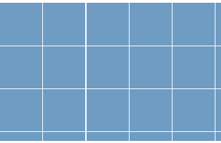

可以设置栅格的大小、沟槽的大小、颜色来设置不同的图案样式

	background: #58a;
	background-image:
	linear-gradient(white 2px, transparent 0),
	linear-gradient(90deg, white 2px, transparent 0),
	linear-gradient(hsla(0,0%,100%,.3) 1px,
	transparent 0),
	linear-gradient(90deg, hsla(0,0%,100%,.3) 1px,
	transparent 0);
	background-size: 75px 75px, 75px 75px,
	15px 15px, 15px 15px;
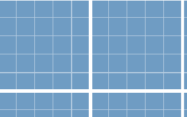

####波尔卡圆点
前提:
	径向渐变radial-gradient

	background: #655;
	background-image: radial-gradient(tan 30%, transparent 0);
	background-size: 30px 30px;

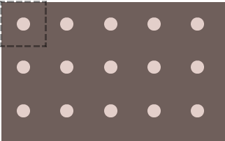

结合两个径向渐变和background-position属性来创建波尔卡圆点
原理

	background: #655;
	background-image: radial-gradient(tan 30%, transparent 0),
	radial-gradient(tan 30%, transparent 0);
	background-size: 30px 30px;
	background-position: 0 0, 15px 15px;

####棋盘背景样式
1.用css方法

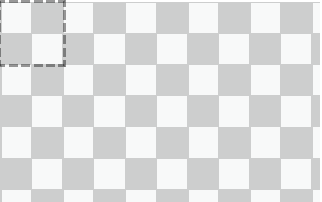

原理是利用两个三角形拼接成一个正方形
(1)

	background: #eee;
	background-image:
	linear-gradient(45deg, transparent 75%, #bbb 0);
	background-size: 30px 30px;

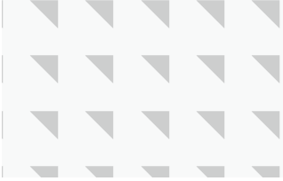

(2)

	background: #eee;
	background-image:
	linear-gradient(45deg, #bbb 25%, transparent 0),
	linear-gradient(45deg, transparent 75%, #bbb 0);
	background-size: 30px 30px;

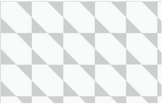

(3)

	background-image:
	linear-gradient(45deg, #bbb 25%, transparent 0),
	linear-gradient(45deg, transparent 75%, #bbb 0),
	linear-gradient(45deg, #bbb 25%, transparent 0),
	linear-gradient(45deg, transparent 75%, #bbb 0);
	background-position: 0 0, 15px 15px,
						 15px 15px, 30px 30px;
	background-size: 30px 30px;

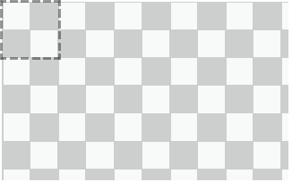

我们可以调整每个三角形的颜色和平铺块的位置重新设置新样式

	background: #eee;
	background-image:
	linear-gradient(45deg,
	rgba(0,0,0,.25) 25%, transparent 0,
	transparent 75%, rgba(0,0,0,.25) 0),
	linear-gradient(45deg,
	rgba(0,0,0,.25) 25%, transparent 0,
	transparent 75%, rgba(0,0,0,.25) 0);
	background-position: 0 0, 15px 15px;
	background-size: 30px 30px;

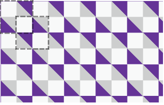

2.用svg方法

	<svg xmlns="http://www.w3.org/2000/svg"
	width="100" height="100" fill-opacity=".25" >
	<rect x="50" width="50" height="50" />
	<rect y="50" width="50" height="50" />
	</svg>

	background: #eee url('data:image/svg+xml,\
	<svg xmlns="http://www.w3.org/2000/svg" \
		width="100" height="100"
		fill-opacity=".25">\
		<rect x="50" width="50" height="50" /> \
		<rect y="50" width="50" height="50" /> \
		</svg>');
	background-size: 30px 30px;

	实际测试中好像不管用

####随机样式的背景
一直重复的背景看起来可能会乏味，我们想使图案看起来自然一些
1.使用多个渐变起始点

	background: linear-gradient(90deg,
	#fb3 15%, #655 0, #655 40%,
	#ab4 0, #ab4 65%, hsl(20, 40%, 90%) 0);
	background-size: 80px 100%;

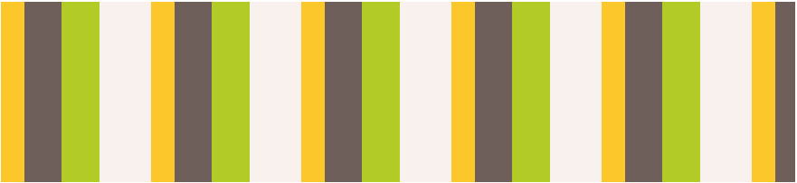

2.使用多个渐变，对每个渐变设置不同的background-size

	background: hsl(20, 40%, 90%);
	background-image:
	linear-gradient(90deg, #fb3 10px, transparent 0),
	linear-gradient(90deg, #ab4 20px, transparent 0),
	linear-gradient(90deg, #655 20px, transparent 0);
	background-size: 80px 100%, 60px 100%, 40px 100%;

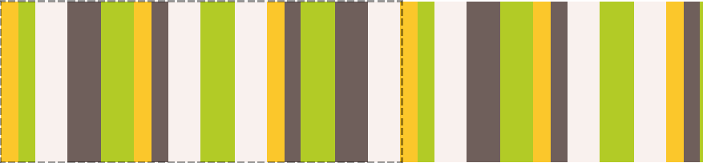

看起来好多了，看细看我们仍会看见平铺块在240px处开始重复，
重复块的长度为三个background-size长度的最小公倍数，所以设置好三个background-size的值，让他的最小公倍数变大即可

	background: hsl(20, 40%, 90%);
	background-image:
	linear-gradient(90deg, #fb3 11px, transparent 0),
	linear-gradient(90deg, #ab4 23px, transparent 0),
	linear-gradient(90deg, #655 41px, transparent 0);
	background-size: 41px 100%, 61px 100%, 83px 100%;
	现在的最小公倍数=41 × 61 × 83 = 207, 583，即大于207,583px,才会重复

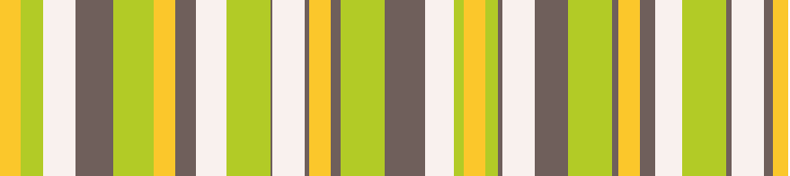

####图片边框
前提：css gradient
	  border-image
	  css animations
	  striped backgrounds
有时，我们需要将某个图案或图片作为一个元素的边框而不是背景

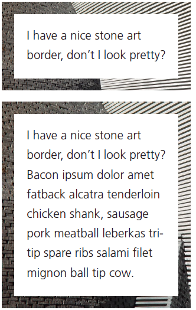

方式1.两个div,外面div做背景，里面div当容器

	

		

			I have a nice stone art border,
			don’t I look pretty?
		

	

	.something-meaningful {
	background: url(stone-art.jpg);
	background-size: cover;
	padding: 1em;
	}
	.something-meaningful > div {
	background: white;
	padding: 1em;
	}

方法2.
使用多背景，使用background-clip background-origin 

	padding: 1em;
	border: 1em solid transparent;
	background: linear-gradient(white, white),
	url(stone-art.jpg);
	background-size: cover;
	background-clip: padding-box, border-box;
	background-origin: border-box;

简写

	padding: 1em;
	border: 1em solid transparent;
	background:
	linear-gradient(white, white) padding-box,
	url(stone-art.jpg) border-box 0 / cover;

用同样的方法可以设置渐变的边框或者条纹状的边框

	padding: 1em;
	border: 1em solid transparent;
	background: linear-gradient(white, white) padding-box,
				repeating-linear-gradient(-45deg,
				red 0, red 12.5%,
				transparent 0, transparent 25%,
				#58a 0, #58a 37.5%,
				transparent 0, transparent 50%)
				0 / 5em 5em;

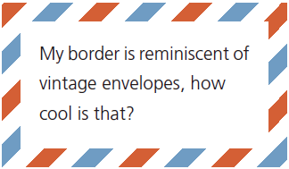		

蚂蚁线边框

	@keyframes ants { to { background-position: 100% } }
	.marching-ants {
		padding: 1em;
		border: 1px solid transparent;
		background:
		linear-gradient(white, white) padding-box,
		repeating-linear-gradient(-45deg,
		black 0, black 25%, white 0, white 50%
	) 0 / .6em .6em;
		animation: ants 12s linear infinite;
	}	